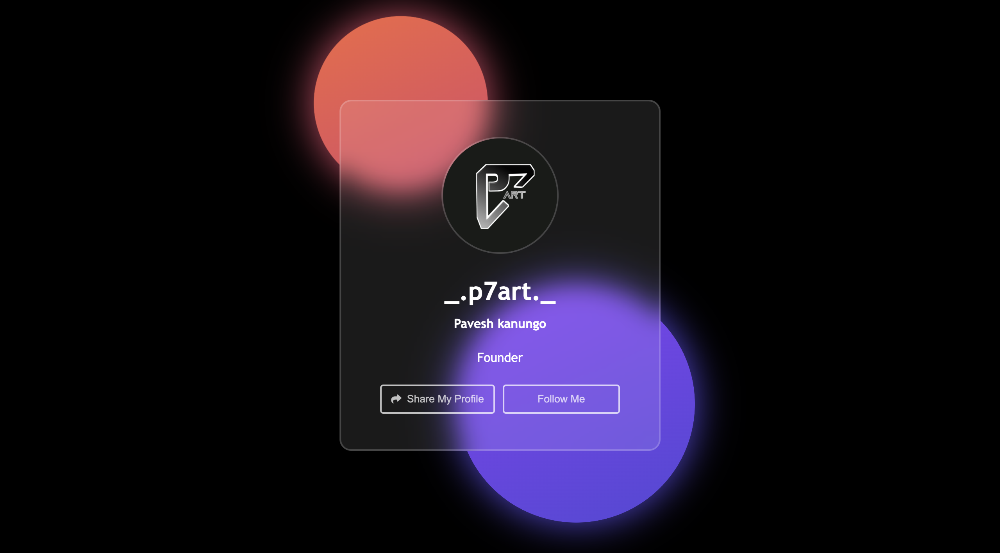

# 💬 Glossy Modal Project

This project is a sleek and visually appealing **modal component** built with **HTML, CSS, and JavaScript**. It displays detailed information about a person—including an image, name, and description—inside a modern, glossy-style popup modal.

---

## 🎯 Purpose

Designed as a UI/UX practice project to build a reusable, animated modal with attractive design aesthetics. It helps practice working with modals, animations, and responsive components.

---

## ✨ Features

- 📸 Displays image, name, and description of a person
- 🌟 Glossy and modern UI with smooth transitions
- ❌ Close modal on button click or outside click
- 💬 Great for user profiles, testimonials, team sections, or portfolio highlights
- 📱 Fully responsive design

---

## 🛠 Technologies Used

- **HTML** – Markup structure
- **CSS** – Styling and glossy effects
- **JavaScript** – Interaction handling

---

## 🚀 How to Use

1. Clone the repository:

```bash
git clone https://github.com/paveshkanungo/Modal-Pavesh-Project.git
cd glossy-modal-project
```

2. Then run from your browser or Go Live from VS Code

---

## 🌟 Screenshots

> 

---


